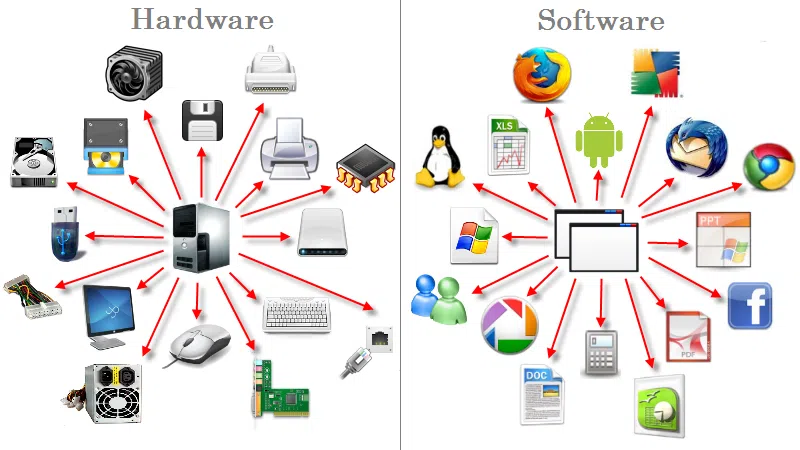

Solución preguntas orientadoras

1). ¿Qué es un computador?

Un computador es un  dispositivo electrónico con la capacidad de recibir, almacenar y procesar información, y el cuál tiene la capacidad de cumplir múltiples labores/tareas indicadas por el  usuario o de manera automática con exactitud y rapidez.

Un computador tiene como partes primordiales lo que serían: La CPU, la memoria y los dispositivos de entrada y salida, y funciona gracias a la existencia de circuitos integrados en sus componentes, así como otros elementos de apoyo que permiten la comunicación entre estos mismos. Por otro lado, otro factor importante para su funcionamiento sería la programación que le sirve a los circuitos del computador para llevar a cabo operaciones lógicas.

Los computadores cuentan con dos conjuntos primordiales las cuales son el "Software" y el "Hardware".

 El software tiene que ver con toda la parte de programas, instrucciones, datos y reglas informáticas para poder realizar todas las tareas que se requieran.

 El hardware tiene que ver con toda la parte de los componentes que integran la parte material de una computadora.

 

 Información obtenida de:

 [Link 1](https://edu.gcfglobal.org/es/informatica-basica/que-es-un-computador/1/)

 [Link 2](https://www.significados.com/computadora/)

 [Link 3](https://cs.uns.edu.ar/materias/iocp/downloads/Clases%20Teoricas/Clase-01-Conceptos-basicos-Hardware.pdf)

2). Arquitectura de un computador
