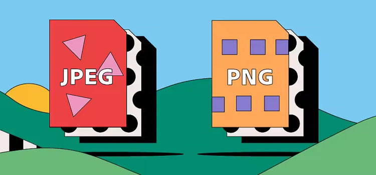

Solución preguntas orientadoras

 ¿Qué es un computador?

Un computador es un  dispositivo electrónico con la capacidad de recibir, almacenar y procesar información, y el cuál tiene la capacidad de cumplir múltiples labores/tareas indicadas por el  usuario o de manera automática con exactitud y rapidez.

Un computador tiene como partes primordiales lo que serían: La CPU, la memoria y los dispositivos de entrada y salida, y funciona gracias a la existencia de circuitos integrados en sus componentes, así como otros elementos de apoyo que permiten la comunicación entre estos mismos. Por otro lado, otro factor importante para su funcionamiento sería la programación que le sirve a los circuitos del computador para llevar a cabo operaciones lógicas.

Los computadores cuentan con dos conjuntos primordiales las cuales son el "Software" y el "Hardware".

 El software tiene que ver con toda la parte de programas, instrucciones, datos y reglas informáticas para poder realizar todas las tareas que se requieran.

 El hardware tiene que ver con toda la parte de los componentes que integran la parte material de una computadora.

 

 Arquitectura de un computador...

 La arquitectura de un computador es el diseño y organización de los componentes físicos y lógicos que conforman a este y define cómo se interrelacionan los distintos componentes, como la Unidad Central de Procesamiento (CPU), la memoria, los dispositivos de entrada/salida y el software, para proporcionar la funcionalidad que se desea.

a. RISC (Conjunto de Instrucciones Reducidas): Se centra en instrucciones simples que pueden ejecutarse rápidamente. 

b.  CISC (Conjunto de Instrucciones Complejas): Utiliza instrucciones más complejas que pueden realizar múltiples tareas. 

El Hardware y sus partes...

 Existe una división en los componentes de un computador (mencionados anteriormente)entre estos el hardware de un computador, este se divide en dos: Hardware interno y periférico.
 
  El hardware interno se encuentra dentro del equipo, como la tarjeta gráfica, los circuitos, la unidad central de procesamiento, la memoria RAM y el disco duro.

Y el hardware periférico lo encontramos fuera del computador, con de elementos como el mouse, el monitor, el teclado, la impresora o la memoria USB.

otras partes del Hardware son:

•	CPU  Hace referencia a los elementos del hardware que conforman el núcleo duro del sistema. Su función principal es la de procesar la información e interpretar y ejecutar las instrucciones, influyendo en la capacidad mecánica del equipo para realizar las operaciones que se necesitan. 

•	ALU:  La unidad aritmética lógica (ALU) realiza operaciones aritméticas básicas (suma, resta, multiplicación y división) y operaciones lógicas (AND, OR, y NOT) sobre los datos. es quien recibe datos, los procesa según las instrucciones y brinda un el resultado.

•	Unidad de control:  La unidad de control gestiona el procesamiento de instrucciones y coordina el flujo de datos dentro de la CPU y entre otros componentes del ordenador. Tiene un componente decodificador de instrucciones que interpreta las instrucciones extraídas de la memoria y las convierte en micro operaciones que la CPU puede ejecutar, además dirige a otros componentes de la CPU para que realicen las operaciones requeridas.  

•	Registros:  Los registros son pequeñas ubicaciones de almacenamiento de memoria de alta velocidad dentro de la CPU que contienen datos en los que la CPU está trabajando en el momento y facilitan un acceso rápido a estos, las CPU tienen varios tipos de registros:

•	Registros de uso general que contienen datos operativos.

•	Registros de instrucciones que contienen la instrucción actual que se está procesando.

•	Un contador de programas que contiene la dirección de memoria de la siguiente instrucción que se va a recuperar.

Estos brindan tiempos de acceso más rápidos que otros niveles de memoria, como la RAM o la memoria caché.

Buses: Son los encargados de transferir datos entre los componentes de un computador, estos estan compuestos por cables o pistas en un circuito impreso dispositivos como resistores y condensadores, además de circuitos integrados.

Existen dos tipos de transferencia en los buses:

1.	Serie: El bus solamente es capaz de transferir los datos bit a bit. Es decir, el bus tiene un único cable que transmite la información.

2.	Paralelo: El bus permite transferir varios bits simultáneamente, por ejemplo 8 bits.
Aunque en primera instancia parece mucho más eficiente la transferencia en paralelo.

¿Qué es Software?

  El software es un conjunto de aplicaciones y programas diseñados para cumplir diversas funciones dentro de un sistema. Además, está conformado por la información del usuario y los datos procesados.

Los programas que forman parte del software le indican al hardware empleando instrucciones, los pasos a seguir.

Estos se clasifican según su función en:

•	Software de sistema:  Dan al usuario la capacidad de relacionarse con el sistema, para ejercer control sobre el hardware. Ejemplo: sistemas operativos o servidores.

•	Software de aplicación. Diseñados para realizar una o más tareas específicas a la vez, ya sea de manera automática o asistida. Por ejemplo: videojuegos o reproductores multimedia.

•	Software de desarrollo. diseñados como herramientas que le permiten a un programador desarrollar programas informáticos. Se valen de técnicas y un lenguaje de programación específico. Por ejemplo: compiladores o editores multimedia.

¿Qué procesos que se llevan a cabo cuando se enciende un computador?

Proceso de arranque 
•	Se pulsa el botón de encendido.
•	El hardware comienza a funcionar, su primer trabajo consiste en ejecutar el POST (power on self test)
•	Se carga y ejecuta el gestor de arranque.
•	Se carga y ejecuta el sistema operativo.

Cuáles son las unidades de medida de datos en un computador?
Las medidas de almacenamiento más comunes Bit, Byte, kilobyte (KB), el megabyte (MB), el gigabyte (GB) y el terabyte (TB).

¿Cómo se codifican los datos internamente en el computador?  

La codificación de datos es el proceso de convertir información en un formato legible por un ordenador para su almacenamiento y procesamiento. Existen varios tipos de codificación de datos:

1. Codificación binaria: 
Esta es la codificación más básica que utiliza sólo dos símbolos, 0 y 1, para representar información.

2. Codificación de caracteres:
Este tipo de codificación utiliza un conjunto de caracteres para representar información.

3. Codificación de imágenes:
Las imágenes se codifican utilizando diferentes formatos, como JPEG, PNG, BMP, etc. 

4. Codificación de audio: 
El audio se puede codificar en diferentes formatos, como MP3, WAV, AAC, etc. 

5. Codificación de video:
El video se puede codificar en diferentes formatos, como AVI, MP4, MKV, etc.

Unidades de medida de datos de un computador Bit,Byte, etc.

1. *Bit (b)*: Es la unidad más pequeña de información y solo puede tomar dos valores: 0 o 1.

2. *Byte (B): Equivale a **8 bits* y es la unidad básica para almacenar datos.  

A partir del byte, se forman unidades mayores en múltiplos de 1024 (2¹⁰):  

3. *Kilobyte (KB)* = 1,024 bytes  
4. *Megabyte (MB)* = 1,024 KB  
5. *Gigabyte (GB)* = 1,024 MB  
6. *Terabyte (TB)* = 1,024 GB  
7. *Petabyte (PB)* = 1,024 TB  
8. *Exabyte (EB)* = 1,024 PB  
9. *Zettabyte (ZB)* = 1,024 EB  
10. *Yottabyte (YB)* = 1,024 ZB  

Mapa con la información:

[imagen](./Mapa%20Mental_%20Computadores.png)

 Información obtenida de:

 [Link 1](https://edu.gcfglobal.org/es/informatica-basica/que-es-un-computador/1/)

 [Link 2](https://www.significados.com/computadora/)

 [Link 3](https://cs.uns.edu.ar/materias/iocp/downloads/Clases%20Teoricas/Clase-01-Conceptos-basicos-Hardware.pdf)

[Link 4](https://www.educaopen.com/digital-lab/metaterminos/a/arquitectura-de-ordenadores)

[Link 5](https://colombia.universidadeuropea.com/blog/que-es-hardware-computadora/)

[Link 6](https://concepto.de/software/)

[Link 7](https://www.esic.edu/rethink/marketing-y-comunicacion/que-es-codificacion-datos-tipos-ejemplos-c)

