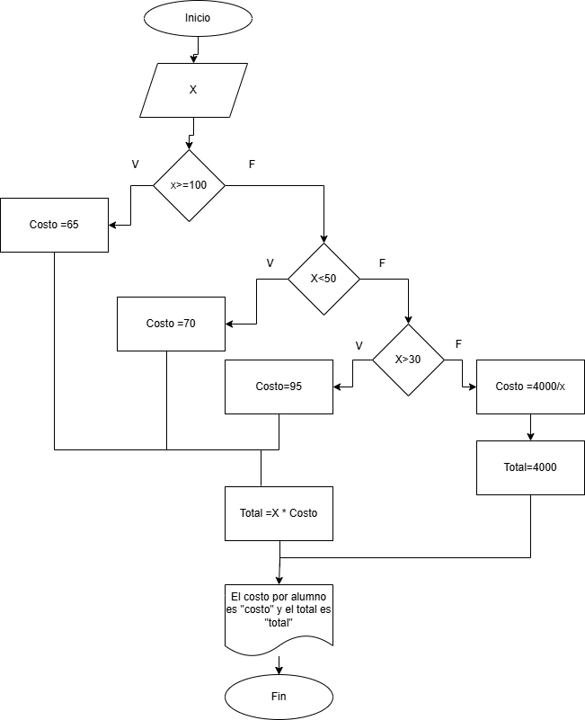

## Ejercicio 1

símbolos que se utilizan para representar cada operación de un algorimo con un diagrama de flujo:


## Ejercicio 2
Algoritmo con datos de un ID de un empleado y los seis primeros sueldos del año de este:


## Ejercicio 2


## Ejercicio 3

Versión Diagrama de flujo


Versión Pseudocódigo:


Versión en C pseudocódigo:
```c:

#include <stdio.h>

int main(void)
{
    char letra;
    int i;
    printf("Escriba y para imprimir 10 veces hola, si no se imprime una sola vez \n");
    scanf ("%c" , &letra);
    if (letra == 'y'){
        i= 10;
        while (i > 0){
            printf ("Hola \n")
            i=i-1;
        }
    }
    else {
        printf ("Hola \n");
    }

    return 0;
}

```

## Ejercicios

- Ejercicio 1


Diagrama de flujo


Pseudocódigo

```txt:
inicio
Escribir " Ingrese cantidad de lápices " , x
Leer x
si X >= 1000
    z= x*85
    
Si no
    z= x*90

fin si

Escribir "El valor total es: " , z

Fin

```

- Ejercicio 2

Diagrama de flujo


Pseudocódigo

```txt:
inicio
Escribir " Ingrese el costo total a pagar por sus compras" , x
Leer x
si X >= 250000
    z= x*0.15
    
Si no
    z= x*0.08

fin si

Calcular y= x - z

Escribir "El valor total a pagar con descuento es: " , y

Fin

```

- Ejercicio 3

Diagrama de flujo


