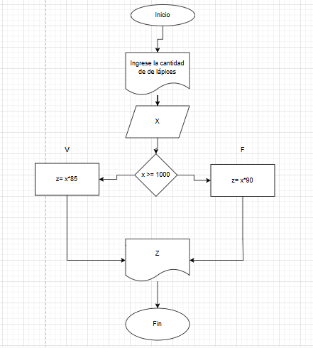

## Ejercicio 1

símbolos que se utilizan para representar cada operación de un algorimo con un diagrama de flujo:


## Ejercicio 2
Algoritmo con datos de un ID de un empleado y los seis primeros sueldos del año de este:


## Ejercicio 3

Versión Diagrama de flujo


Versión Pseudocódigo:


Versión en C pseudocódigo:
```c:

#include <stdio.h>

int main(void)
{
    char letra;
    int i;
    printf("Escriba y para imprimir 10 veces hola, si no se imprime una sola vez \n");
    scanf ("%c" , &letra);
    if (letra == 'y'){
        i= 10;
        while (i > 0){
            printf ("Hola \n")
            i=i-1;
        }
    }
    else {
        printf ("Hola \n");
    }

    return 0;
}

```

## Ejercicios

- Ejercicio 1


Diagrama de flujo



Pseudocódigo

```txt:
inicio
Escribir " Ingrese cantidad de lápices " , x
Leer x
si X >= 1000
    z= x*85
    
Si no
    z= x*90

fin si

Escribir "El valor total es: " , z

Fin

```

- Ejercicio 2

Diagrama de flujo


Pseudocódigo

```txt:
inicio
Escribir " Ingrese el costo total a pagar por sus compras" , x
Leer x
si X >= 250000
    z= x*0.15
    
Si no
    z= x*0.08

fin si

Calcular y= x - z

Escribir "El valor total a pagar con descuento es: " , y

Fin

```

- Ejercicio 3

Diagrama de flujo


## Actividad de Evaluación: Comprensión de Conceptos

## Parte 1: Algoritmos

1. No, una página web es un conjunto de información, no un proceso secuencial con pasos definidos.  

2. Sí, la receta tiene instrucciones ordenadas y precisas para lograr un resultado (Determinada comida).  

3. No, falta una secuencia clara de pasos y un criterio de finalización.  

4. Sí, contiene instrucciones detalladas con un orden específico para lograr un objetivo (Armar un mueble).  

5. No, es solo una lista de elementos (Comida) sin instrucciones para su uso o procesamiento.  


## Parte 2: Variables y Constantes

1. Constante, la gravedad en la Tierra siempre es la misma. 

2. Variable, la edad cambia con el tiempo.  

3. Variable, la cantidad de dinero en una cuenta puede aumentar o disminuir.  

4. Constante, la velocidad de la luz es un valor fijo.  

5. Variable, e  l radio de un círculo puede cambiar dependiendo del círculo.  

## Parte 3: Características de los Algoritmos

1. No. No es preciso ni finito, ya que depende de cambios subjetivos.  

2. Sí.Tiene pasos definidos y produce un resultado.  

3. Sí. Es preciso, definido y tiene una salida clara.  

4. Sí. Tiene un inicio, instrucciones claras y una condición de finalización.  

## Parte 4: Pseudocódigo y Diagramas de Flujo

1. Falso. El pseudocódigo usa lenguaje natural estructurado, no símbolos estándar.  

2. Verdadero. Representan visualmente la lógica de un algoritmo.

3. Falso. El pseudocódigo es independiente del lenguaje de programación.  

4. Verdadero. Un diagrama de flujo siempre debe tener un inicio y un fin.  

## Parte 5: Estructuras de Control

Las estructuras de control son las que permiten definir el flujo de un algoritmo, estableciendo condiciones y repeticiones.  

*Ejemplo de la vida diaria:*  
Si está lloviendo, entonces debo llevar una sombrilla; si no, no debo llevarla.  

*Ejemplo matemático:*  
Si el saldo en una cuenta es mayor a $500.000 pesos, se puede retirar dinero; si no, se muestra un mensaje de saldo insuficiente.
